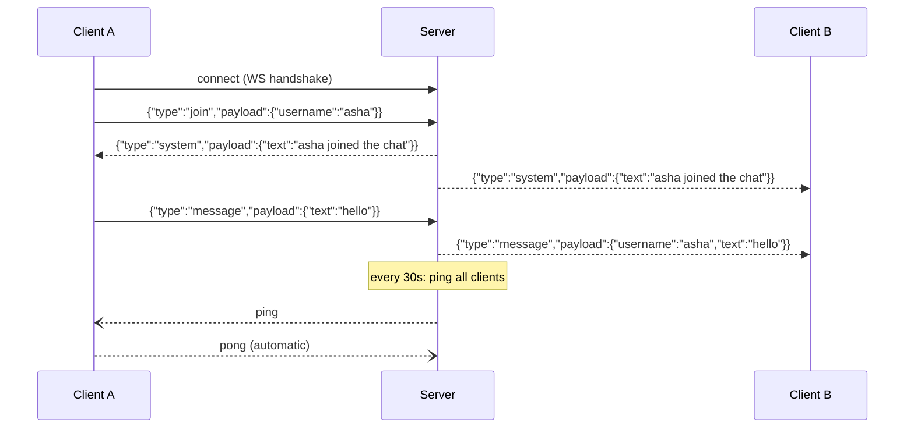

# WebSocket Chat — Backend

The WebSocket server for a real-time chat app. Deployed separately from [the frontend](link-to-frontend-repo) — see that repo for the React client.

**Live backend:** ``
**Live app:**  ← this is the one to actually try

## How it works



## Features
- Custom JSON message protocol (`join`, `message`, `system`, `users`, `typing`, `error`)
- Heartbeat-based dead-connection detection (ping/pong every 30s)
- Input validation, message-length limits, per-client rate limiting

## Tech stack
Node.js, `ws`

## Running locally
```bash
npm install
npm run dev
```
Server listens on `PORT` env var, defaulting to `3006`.

## Environment variables
| Variable | Purpose | Local default |
|---|---|---|
| `PORT` | Port to listen on | `3006` |

## What I'd improve next
- Message history / persistence
- Rooms instead of one global chat